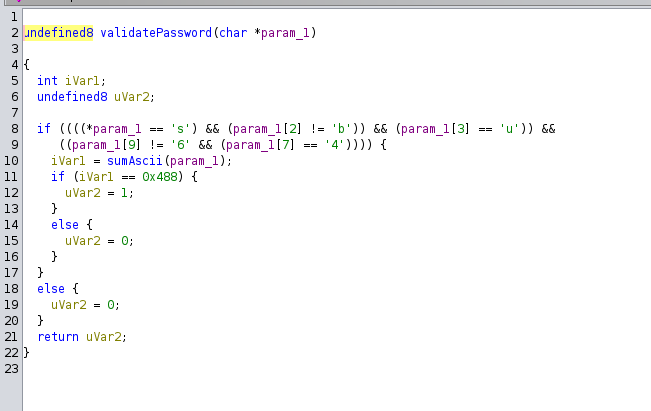

# Paisa recover - writeup

first unpack the binary with 
  `upx -d bank`

In this challenge we need to transfer money to a specific account to get the flag.

## bypass the password
1. when we run the file we first see that it asks for a password
2. if we decompile it in ghidra we can see that it validates the password in the validatePassword function

validatePassword function:

3. so we need to make a password which fills this criteria, we can do this either manually or through a script. I did it manually and came up with this passwd "s22u222422222222222L", though the original passwd was "s3cur3p4sswd"

4. since some ppl were having trouble with this part, there is another approach, add a breakpoint before the validatePassword fucntion and jump to the point after it. but youll have to be careful since a part of the flag gets created right after the passwd validation function.

## Accessing the transaction fucntion
1. After entering the passwd we are shown a menu, if goto bank and send money it shows us the following message.

2. There is a check which stops the transaction fucntion from being called. we will have to call the transaction function manually, for this we can simple add a breakpoint and jump to the function.

3. once we access the transaction function we will have to set the parameter values to 0xdeadbeef and 0xdeadface
    `set $edi = 0xdeadbeef`
    `set $esi = 0xdeadface`
    
5. then we need to find the account number and amount from the validateAccount and getAmount functions, there is no check on name so that can be any value.

## getting amount and account num
1. looking at the decompiled code, we can see that getAmount function just takes a number 454 multiplies it by 3, 5 times and add 59681 to it
    giving is the amount 170003

2. In the validateAccount function our input is obfuscated and compared to a string "?:G@BLIKH))/2)+-./01"

3. we are shown the first 2 characters of the accoutn num in the function "F" and "A", we can compare the values to see how it was changed

4. F is 46 in hex and A is 41; F becomes '?' which is 3F  and A becomes ":" which is 3A

5. this is a difference of 7, so we can write a script like (getAccount.py) to add 0x7 to each character to get the original account number

6. doing this we get "FANGISPRO00690245678"

## getting the flag
1. now we simply need to enter all the values to get the flag

